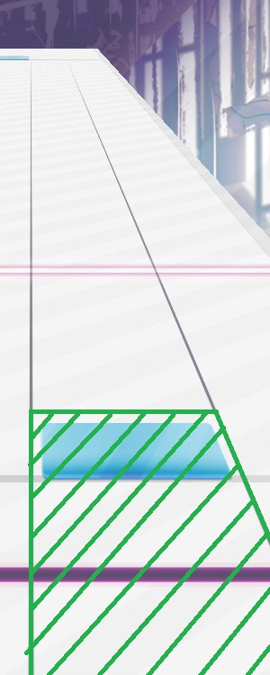

# Arcaeaの細かな判定仕様
###### Author: [MIYUKINNGU](https://x.com/Scr_MIYUKINNGU2)

## はじめに
判定幅について、負の範囲がEarly判定になる判定幅です。逆に正の範囲がLate判定になる判定幅です。
タッチ判定吸収範囲とは、正しいリズムで叩いた時、そのタッチ判定が認識される画面上の範囲です。
また、Arcaeaにおいて判定は完全にフレームレート依存である。
そのため、リフレッシュレート60Hzの機種と120Hzの機種ではAegleseekerのFTRの序盤などで同じ取り方ができず、60Hzの機種が不利になる場合が存在する。

## フロアノーツ
### 判定幅
Arcaea Wikiとゲームの挙動より
| 判定名 | 判定幅(ms) | 備考 |
|:-----:|:----------:|:-----|
| Pure(内部) | ±25ms | Arcaeaのプレイ設定でPure L/E表示を有効にしなければ表示されない。 |
| Pure | ±50ms |   |
| Far | ±100ms |   |
| Lost | 不明 | Early Lostについてのみ不明。Late LostはFar判定がされなくなったタイミングかと思われる。 |

### タッチ判定吸収範囲
判定線とSky Inputの真ん中[^1]より下かつ画面上でのレーンの表示に沿うような形で範囲が設定されている。(ゲームの挙動から確認可能)
ただし、一番左/右のレーンについては画面端までの範囲が設定されている。
具体的には下の画像に示す緑の範囲である。

## スカイノーツ
### 判定幅
フロアノーツと同じであると思われる。
詳細はフロアノーツの判定幅を参照。

### タッチ判定吸収範囲
詳細は不明である。
一般には縦範囲はフロアノーツよりも狭く、横範囲はフロアノーツより大きいとされている。

## ホールドノーツ
### 判定幅
ホールドノーツには2種類の方法で判定を行っていると思われる。
#### 判定A
ホールドノーツの時間軸に対するタッチ判定吸収範囲である。
| 判定名(仮) | 判定幅(ms) | 備考 |
|:-----:|:----------:|:-----|
| TRUE | ±100ms | ホールドノーツがタップされている状態を示し、この判定幅における0とは始点から終点までの全ての範囲である。 |
| FALSE | otherwise | ホールドノーツがタップされていない状態を示す。 |

#### 判定B
ホールドの中継地点での判定幅である。
中継地点自体はホールドの始点から終点までをホールド自身が持つ固有値の数だけ等分した位置に設けられている。
| 判定名 | 判定幅(ms) | 備考 |
|:-----:|:----------:|:-----|
| Pure(内部) | +100ms | Early寄りで判定されることはない |
| Lost | otherwise |  |

ホールドノーツの挙動はまだはっきりしていないので検証が必要である。
(いずれもゲームの挙動から)

### タッチ判定吸収範囲
フロアノーツと同じであると思われる。
詳細はフロアノーツのタッチ判定吸収範囲を参照。

## アークノーツ
### 判定幅
一番よくわかっていない。
判定はPure(内部)とLostの二種類である。
基本的には離したら次の中継地点が必ずLostになるようだが、一部の譜面においてそうならない場合も存在する。(固有値が存在する？)
また、BPMに対して一定の速度(細かさ)でアークノーツを離したとしてもLost判定にはならない。
msで表す判定幅自体はホールドノーツの判定Bとほとんど同じと思われるがそのほかの詳細な仕様によってそこまで単純ではない。

### タッチ判定吸収範囲
アークノーツの中心から特定の半径分、円形に設けられている。
この範囲はかなり狭く、スカイノーツのタッチ判定吸収範囲の縦幅が直径になる程度と思われる。
詳細は不明である。

---

## 脚注
1. 正確に50%の位置ではないものと予想される。実際の値は不明。

[^1]: #foot-note1